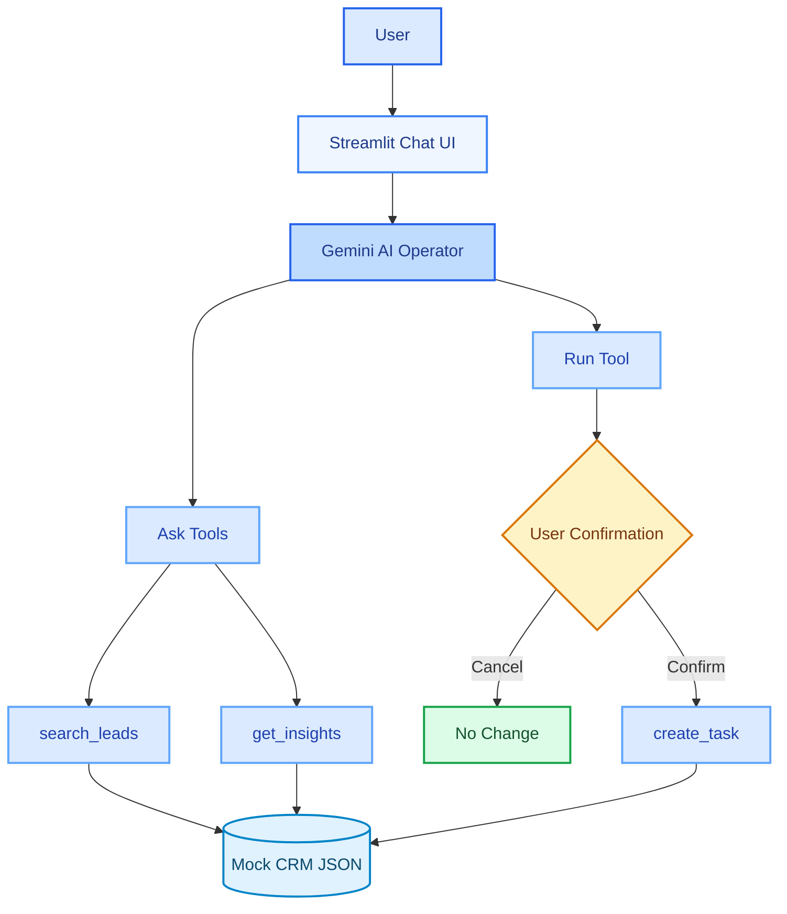
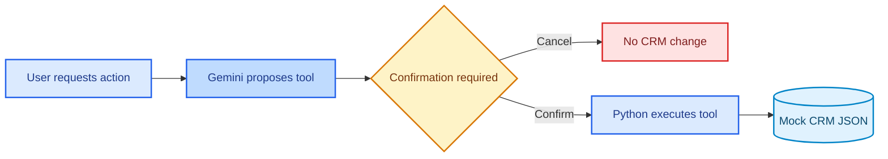

# NexCell AI Operator

A small working prototype of an AI-powered CRM operator built for the **NexCell Autumn Cohort AI Challenge**.

The challenge asked candidates to build a simplified version of an **AI Operator**: a chat-based system that can understand natural-language requests, use typed tools to interact with a small CRM dataset, and safely perform CRM actions with explicit user confirmation before any write operation.

This prototype focuses on the core interaction, tool-calling, execution, and safety patterns rather than attempting to reproduce the full production ConneX platform.

---

## Challenge Overview

The NexCell challenge was designed around the concept of an **AI Operator** within a CRM environment.

The requested prototype needed to demonstrate that an AI assistant could:

1. Accept natural-language requests through a chat interface.
2. Understand whether the user is asking for information or requesting an action.
3. Select and call appropriate typed tools.
4. Query or modify a small fictional CRM dataset.
5. Require explicit user confirmation before making changes.
6. Avoid inventing CRM information when the requested data does not exist.
7. Clearly reject operations that are not supported.
8. Use a real language model rather than a completely hard-coded chatbot.

The challenge did **not** require integration with a real ConneX environment, real client data, authentication, multi-tenancy, or a production deployment.

This implementation therefore uses a small fictional CRM dataset stored locally as JSON.

---

## What This Prototype Implements

The prototype provides:

* A Streamlit chat interface
* Real Google Gemini LLM integration
* Typed CRM tools
* Read-only **Ask** tools
* A write **Run** tool
* Explicit confirmation before CRM writes
* A fictional CRM dataset
* Separation between model reasoning and application execution
* Handling for missing CRM records
* Clear rejection of unsupported operations

The core design follows the challenge principle:

> **The model talks, but application code operates.**

The LLM can decide which tool should be used, but Python application code is responsible for executing the actual operation and changing CRM data.

---

## Architecture



### Write Safety Flow

Write operations are deliberately separated from read operations.



---

## AI Operator Flow

A typical interaction follows this sequence:

```text
User
  |
  v
Streamlit Chat Interface
  |
  v
Gemini AI Operator
  |
  +----------------------+
  |                      |
  v                      v
Ask Tool              Run Tool
  |                      |
  v                      v
Read CRM             Confirmation
                         |
                    +----+----+
                    |         |
                 Confirm    Cancel
                    |         |
                    v         v
              Execute      No Change
                    |
                    v
                CRM Data
```

The LLM is responsible for interpreting the request and selecting the appropriate tool.

The Python application is responsible for:

* validating the tool request
* enforcing the confirmation requirement
* executing the tool
* reading or writing CRM data
* returning the result to the user

---

## LLM Provider

**Provider:** Google Gemini
**Model:** `gemini-3.5-flash-lite`
**SDK:** `google-genai`

The model is used for natural-language interpretation and tool selection.

The model does **not** directly access or modify the CRM JSON file.

Instead, it produces a structured tool request which is handled by the application.

---

## Available Tools

The prototype implements the minimum required tool pattern with both **Ask** and **Run** functionality.

### Ask Tools

Ask tools are read-only operations and can be executed without confirmation.

### `search_leads(query)`

Searches the fictional CRM dataset for matching leads.

The search considers:

* Lead ID
* Name
* Company
* Email
* Interest
* Status

Example:

```text
User:
Find the leads interested in AI automation.
```

The operator can call:

```text
search_leads("AI automation")
```

The result is generated from the actual mock CRM dataset.

---

### `get_insights()`

Returns computed CRM statistics.

The tool currently provides:

* Total number of leads
* Lead status counts
* Total number of tasks
* Number of pending tasks

Example:

```text
User:
How many leads are currently in the CRM?
```

The operator can call:

```text
get_insights()
```

The result is calculated from the current dataset rather than being hard-coded into the response.

---

## Run Tool

### `create_task(title, due, related_to)`

Creates a new task in the fictional CRM dataset.

This is a **write operation**.

Therefore, the tool is never executed immediately after the model requests it.

Instead:

```text
User request
      |
      v
Gemini proposes create_task
      |
      v
Application intercepts request
      |
      v
Confirmation shown to user
      |
   +--+--+
   |     |
Confirm Cancel
   |     |
   v     v
Write  No write
```

Only selecting **Confirm** causes the Python application to execute `create_task()` and modify the CRM JSON file.

Selecting **Cancel** leaves the CRM unchanged.

---

## Safety Design

The prototype follows the key safety principles specified in the challenge.

### 1. Model Talks, Code Operates

The Gemini model is responsible for understanding the user's request and selecting an appropriate tool.

It does not directly manipulate the CRM dataset.

For example:

```text
User
  |
  v
Gemini
  |
  v
"Use create_task with these arguments"
  |
  v
Python application
  |
  v
create_task()
  |
  v
CRM JSON
```

This separation prevents the LLM from directly performing data mutations.

---

### 2. Confirm Before Act

All write operations require explicit confirmation.

For example:

```text
User:
Create a task to call Aisha Khan tomorrow.

        ↓

Gemini proposes:
create_task(
    title="Call Aisha Khan",
    due="tomorrow",
    related_to="L001"
)

        ↓

Application:
"Do you want to create this task?"

        ↓

      Confirm / Cancel

        ↓
      Confirm
        ↓
   Python executes
        ↓
      CRM updated
```

The confirmation is implemented by the Streamlit application rather than relying on the LLM to decide whether confirmation is necessary.

This means the safety boundary is enforced in application code.

---

### 3. Never Invent

The operator is designed to use the CRM tools as the source of truth.

If a requested record does not exist, the system reports that it was not found.

For example:

```text
User:
Find the lead John Smith.

Assistant:
No lead named "John Smith" was found in the CRM.
```

The system does not create or infer a fictional CRM record to satisfy the request.

---

### 4. Fail Loud

Requests for unsupported operations are explicitly rejected.

For example:

```text
User:
Delete all leads from the CRM.
```

The operator responds that deletion is unsupported rather than attempting to simulate the operation or silently doing nothing.

The currently available tools only support the operations implemented by the application.

---

## Mock CRM Dataset

The prototype uses a small fictional CRM dataset stored in:

```text
data/crm_data.json
```

Example lead records include:

```text
L001 — Aisha Khan — TechNova
L002 — James Wilson — DataBridge
L003 — Sophie Brown — CloudWorks
L004 — Daniel Patel — FinEdge
L005 — Emily Carter — HealthTech
```

The dataset also contains example CRM tasks.

All data is fictional and exists only to demonstrate the AI Operator functionality.

**No real client, customer, ConneX production, or confidential data is used.**

---

## Project Structure

```text
nexcell-ai-operator/
│
├── agent/
│   ├── ai_operator.py
│   └── tools.py
│
├── data/
│   └── crm_data.json
│
├── app.py
├── test_tools.py
├── test_gemini.py
├── requirements.txt
├── .env.example
├── .gitignore
└── README.md
```

### Key Components

**`app.py`**

Streamlit chat interface and confirmation workflow.

**`agent/ai_operator.py`**

Gemini integration, tool declarations, tool selection, and handling of confirmation-required actions.

**`agent/tools.py`**

Application-side CRM operations that read and modify the mock dataset.

**`data/crm_data.json`**

Fictional CRM leads and tasks.

**`test_tools.py`**

Basic tests for the local CRM tools.

**`test_gemini.py`**

Basic test for Gemini connectivity.

**`.env.example`**

Example environment configuration without exposing the actual API key.

---

## Setup

### Requirements

* Python 3.10+
* Google Gemini API key
* Internet connection for Gemini API calls

### 1. Clone the repository

```bash
git clone <repository-url>
cd nexcell-ai-operator
```

### 2. Create a virtual environment

```bash
python -m venv .venv
```

Activate it on Windows PowerShell:

```powershell
.venv\Scripts\Activate.ps1
```

### 3. Install dependencies

```bash
pip install -r requirements.txt
```

### 4. Configure the Gemini API key

Copy the example environment file:

```powershell
Copy-Item .env.example .env
```

Open `.env` and add your Gemini API key:

```text
GEMINI_API_KEY=your_api_key_here
```

> `.env` is excluded from Git using `.gitignore` and must never be committed to source control.

### 5. Run the application

```bash
streamlit run app.py
```

The Streamlit interface will open in the browser.

---

## Example Interactions

### Example 1 — CRM Search

```text
Find the leads interested in AI automation.
```

The operator uses:

```text
search_leads()
```

and returns matching records from the mock CRM.

---

### Example 2 — CRM Insights

```text
How many leads are in the CRM?
```

The operator uses:

```text
get_insights()
```

and returns statistics computed from the dataset.

---

### Example 3 — Safe CRM Write

```text
Create a task to call Aisha Khan tomorrow.
```

The operator identifies the relevant lead and proposes:

```text
create_task(
    title="Call Aisha Khan",
    due="tomorrow",
    related_to="L001"
)
```

The application then displays a confirmation interface.

The task is only written after the user selects **Confirm**.

---

### Example 4 — Cancelled Write

```text
Create a task to call Aisha Khan tomorrow.
```

If the user selects **Cancel**, the operation is not executed and the CRM remains unchanged.

This demonstrates the confirmation boundary required for write operations.

---

### Example 5 — Missing Data

```text
Find the lead John Smith.
```

If no matching record exists, the operator reports that the lead was not found.

It does not invent a CRM record.

---

### Example 6 — Unsupported Operation

```text
Delete all leads from the CRM.
```

The operator clearly rejects the request because deletion is not an available operation.

---

## Testing

The repository contains basic tests for both the local tools and Gemini connectivity.

### Test CRM Tools

```bash
python test_tools.py
```

This verifies operations such as:

* Lead searching
* CRM statistics calculation

### Test Gemini Connectivity

```bash
python test_gemini.py
```

This verifies that the configured Gemini API key can successfully make a model request.

### End-to-End Testing

The Streamlit application can also be tested manually using the example interactions above.

The most important safety test is:

```text
Create a task to call Aisha Khan tomorrow.
```

The application should display a confirmation request before changing the CRM.

Selecting **Cancel** should result in no data change.

Selecting **Confirm** should create the task.

---

## Challenge Requirements Mapping

| NexCell Challenge Requirement     | Implementation                   |
| --------------------------------- | -------------------------------- |
| Real chat interface               | Streamlit chat UI                |
| Real language model               | Google Gemini                    |
| At least one Ask tool             | `search_leads()`                 |
| Additional Ask functionality      | `get_insights()`                 |
| At least one Run tool             | `create_task()`                  |
| Typed tools                       | Structured function declarations |
| Small invented dataset            | `data/crm_data.json`             |
| Model decides what should happen  | Gemini tool selection            |
| Code performs operations          | Python tool functions            |
| Confirmation before writes        | Streamlit confirmation workflow  |
| Do not invent CRM data            | Tool-backed CRM responses        |
| Fail unsupported requests clearly | Unsupported-operation handling   |
| Short documentation               | This README                      |
| No production/client data         | Fictional local dataset          |

---

## Design Decisions

### Why JSON instead of a database?

The challenge only requires a small invented dataset.

A JSON file keeps the prototype simple and makes the tool execution easy to inspect and demonstrate.

For a production system, this would be replaced by a proper database or CRM API.

### Why Streamlit?

Streamlit provides a simple way to demonstrate a functional conversational interface without spending most of the challenge implementation time on frontend development.

The important part of the prototype is the interaction between:

```text
Chat → LLM → Typed Tool → Safety Check → CRM
```

### Why Gemini?

Gemini provides the required real LLM capability while supporting structured tool/function calling through the Google GenAI SDK.

---

## Limitations and Future Improvements

This implementation intentionally focuses on the core AI Operator requirements rather than production infrastructure.

Potential future improvements include:

* Additional CRM tools such as `update_lead_status()`
* Calendar integration
* More sophisticated date parsing and validation
* Stronger tool argument validation
* Persistent database storage
* Authentication
* Multi-tenant access control
* Audit logging
* More comprehensive automated testing
* Production-grade error handling
* Deployment to a hosted environment
* More advanced observability and monitoring

These features were kept outside the scope of this challenge prototype.

---

## Scope

This project is a **demonstration prototype**, not a production CRM system.

It intentionally does not include:

* Real ConneX or client-system integration
* Real customer data
* Authentication
* Multi-tenant permissions
* Production database infrastructure
* Audit logging
* Voice interaction
* File attachments
* Production deployment

The implementation concentrates on demonstrating the requested **AI Operator + typed tools + safe execution** pattern.

---

## Summary

This prototype demonstrates a complete end-to-end AI Operator workflow:

```text
Natural-language request
          ↓
     Gemini LLM
          ↓
    Tool selection
          ↓
   ┌──────┴──────┐
   ↓             ↓
 Read          Write
   ↓             ↓
CRM result   Confirmation
                 ↓
            Confirm / Cancel
              ↓       ↓
           Execute   No change
              ↓
          Mock CRM
```

The implementation demonstrates the central NexCell design principle:

> **The model decides what should happen; application code decides how it happens and enforces the safety boundary.**
